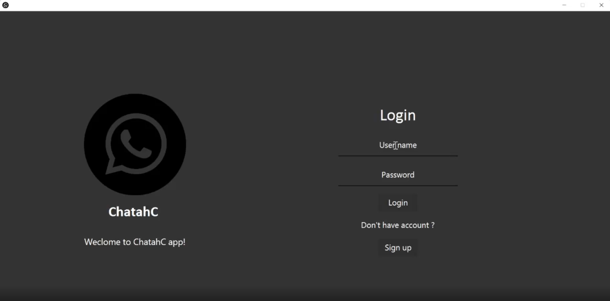
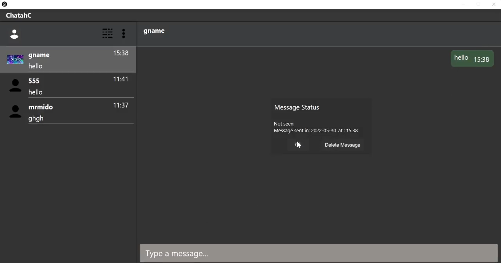
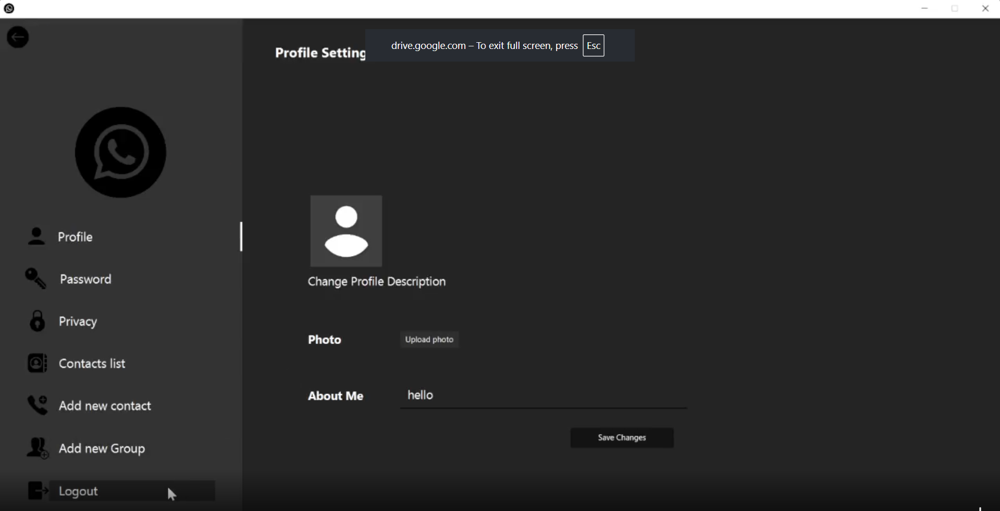

# Chatahc - Modern Chat Application

A feature-rich desktop chat application built with JavaFX, featuring real-time messaging, stories, group chats, and comprehensive privacy controls.

## 📱 Overview

Chatahc is a modern messaging application inspired by popular chat platforms. It provides a complete communication suite with private messaging, group chats, ephemeral stories, contact management, and granular privacy settings - all wrapped in a polished JavaFX desktop interface.

## [🎥 Live Demo](https://drive.google.com/file/d/19w8NKnkcIFo2hWr0-8WKiCoDaajRzbnB/view)

## 📸 Screenshots

| Login | Home Chat | Settings |
|-------|-----------|----------|
|  |  |  


## ✨ Key Features

### 💬 Messaging
- **Private Chats** - One-on-one conversations with custom contact names
- **Group Chats** - Create groups with multiple participants, custom names & images
- **Real-time Message Delivery** - Instant message sending with timestamps
- **Message Status Tracking** - Seen/unseen indicators with double-click to view details
- **Message Deletion** - Remove sent messages
- **Unread Message Counters** - Badge notifications on chat list
- **Auto-scroll** - Latest messages always visible

### 📸 Stories (Ephemeral Content)
- **Text Stories** - Share text updates with friends
- **Image Stories** - Upload and share photos
- **24-hour Expiry** - Automatic cleanup of expired stories
- **Story Navigation** - Browse through stories with next/previous controls
- **Privacy-aware** - Only visible to mutual contacts based on privacy settings

### 👥 Contact Management
- **Add Contacts by Phone Number** - Search and add users
- **Custom Contact Names** - Personalize how contacts appear in your list
- **Contact List View** - Browse all saved contacts
- **Mutual Connection Detection** - Automatic chat room creation when both users add each other

### 🔒 Privacy & Security
- **Profile Visibility Modes**:
  - *Everyone* - Public profile visible to all users
  - *Contacts Only* - Profile visible only to saved contacts
- **Password Management** - Secure password reset functionality
- **Profile Customization** - Update bio, profile picture, and display name
- **Session Management** - Secure logout with confirmation

### 🎨 User Experience
- **Custom Contact Avatars** - Profile images with default fallbacks
- **Group Chat Images** - Custom group icons
- **Responsive UI** - Fixed-size optimized layout (1538×785)
- **Keyboard Shortcuts** - Enter to send messages
- **Confirmation Dialogs** - Prevent accidental actions (logout, close)

## 🛠 Technology Stack

| Category | Technologies |
|----------|--------------|
| **Language** | Java 17+ |
| **UI Framework** | JavaFX (FXML + CSS) |
| **Database** | MySQL (JDBC) |
| **Build Tool** | Maven / Gradle compatible |
| **Architecture** | MVC Pattern with FXML Controllers |
| **Styling** | Custom CSS for all UI components |

### Key Libraries
- **JavaFX Controls** - Core UI components (ListView, TextField, ImageView, etc.)
- **JFoenix** - Material Design components (JFXTextArea for stories)
- **MySQL Connector/J** - Database connectivity
- **java.sql** - JDBC API for prepared statements & transactions

## 🏗 Project Structure

```
src/
├── Chatahc/                 # Core domain models & data access
│   ├── App.java             # Database operations & business logic
│   ├── User.java            # User entity
│   ├── Message.java         # Message entity
│   ├── Story.java           # Story entity (24hr expiry)
│   ├── ChatRoom.java        # Chat room entity (private/group)
│   └── Main.java            # Entry point (legacy)
│
├── GUI/                     # JavaFX Controllers & Utilities
│   ├── Main.java            # Application entry point
│   ├── HomeController.java  # Main chat interface
│   ├── LoginController.java # Authentication
│   ├── SignUpController.java# User registration
│   ├── OptionsController.java # Settings hub
│   ├── Privacy.java         # Profile visibility settings
│   ├── NewGroup.java        # Group creation wizard
│   ├── StoryView.java       # Stories browser
│   ├── AddStory.java        # Story creation (text/image)
│   ├── Utilities.java       # Navigation & helper methods
│   ├── CustomAlert.java     # Reusable dialog system
│   ├── ProfileDescription.java # Profile preview
│   ├── MessageOptions.java  # Message status popup
│   ├── ContactList.java     # Contacts viewer
│   └── SetProfile.java      # Profile photo setup
│
├── cells/                   # Custom ListView Cell Factories
│   ├── UserListCell.java    # Chat list items
│   ├── UserCustomCell.java  # Chat list rendering
│   ├── MessageCustomCell.java # Message bubbles (in/out)
│   ├── StoryListCell.java   # Story list items
│   └── StoryCustomCell.java # Story list rendering
│
├── UI/                      # FXML Layouts
│   ├── home_view.fxml       # Main chat window
│   ├── Login.fxml           # Login screen
│   ├── SignUp.fxml          # Registration screen
│   ├── story_page.fxml      # Stories viewer
│   ├── type_story.fxml      # Text story input
│   ├── uploadStoryPhoto.fxml# Image story input
│   ├── Options_*.fxml       # Settings screens
│   ├── InMessage.fxml       # Received message bubble
│   ├── OutMessage.fxml      # Sent message bubble
│   └── Alert.fxml           # Custom dialog
│
└── resources/
    ├── css/                 # Stylesheets
    │   ├── cellViewCss.css
    │   ├── messageCellViewCss.css
    │   ├── profilesettings.css
    │   ├── textField.css
    │   └── usersListViewCss.css
    └── img/                 # Icons & default images
        ├── Chatahc.png      # App icon
        ├── userDefaultImage.png
        ├── Group.png
        └── ... (UI icons)
```

## 🗄 Database Schema (MySQL)

Core tables used by the application:

```sql
-- Users table
CREATE TABLE user (
    id INT PRIMARY KEY AUTO_INCREMENT,
    username VARCHAR(50) UNIQUE NOT NULL,
    password VARCHAR(100) NOT NULL,
    phoneNumber VARCHAR(20) UNIQUE NOT NULL,
    userImageLink VARCHAR(255),
    profileDesc VARCHAR(200) DEFAULT 'default',
    profileVisibility BOOLEAN DEFAULT TRUE
);

-- Private/Group chat rooms
CREATE TABLE chatRoom (
    id INT PRIMARY KEY AUTO_INCREMENT,
    name VARCHAR(50) NOT NULL,           -- 'private' for 1-on-1
    dateOfGroupCreation DATE,
    timeOfGroupCreation TIME,
    chatroomImageLink VARCHAR(255)
);

-- User-Chat room membership
CREATE TABLE userJoinChat (
    userId INT,
    chatId INT,
    lastDateChatOpened DATE,
    lastTimeChatOpened TIME,
    dateTimeUserOpenedThisChat DATETIME,
    isBlocked BOOLEAN DEFAULT FALSE,
    PRIMARY KEY (userId, chatId)
);

-- User connections (contacts)
CREATE TABLE userConnection (
    userId INT,
    friendId INT,
    friendName VARCHAR(50),              -- Custom contact name
    PRIMARY KEY (userId, friendId)
);

-- Messages
CREATE TABLE message (
    id INT PRIMARY KEY AUTO_INCREMENT,
    senderId INT,
    chatId INT,
    messageText TEXT,
    date DATE,
    time TIME,
    seenStatus BOOLEAN DEFAULT FALSE,
    dateTime TIMESTAMP DEFAULT CURRENT_TIMESTAMP
);

-- Message read receipts
CREATE TABLE messageViewer (
    userId INT,
    messageId INT,
    PRIMARY KEY (userId, messageId)
);

-- Stories (24-hour TTL)
CREATE TABLE story (
    id INT PRIMARY KEY AUTO_INCREMENT,
    storyUploaderId INT,
    Text TEXT,
    isImage BOOLEAN,
    storyDateUploaded DATE,
    storyTimeUploaded TIME,
    storyDateTimeAdded TIMESTAMP DEFAULT CURRENT_TIMESTAMP
);
```

## 🚀 Getting Started

### Prerequisites
- Java 17 or higher
- MySQL Server 8.0+
- Maven or Gradle (optional, can run via IDE)

### Database Setup
1. Create a MySQL database named `chatahc`
2. Run the schema SQL above to create tables
3. Update database credentials in `Chatahc/App.java:15`:
   ```java
   con = DriverManager.getConnection("jdbc:mysql://localhost:3306/chatahc", "root", "your_password");
   ```

### Running the Application
```bash
# Using Maven (if pom.xml exists)
mvn javafx:run

# Using Gradle (if build.gradle exists)
gradle run

# Or run directly from IDE:
# Right-click GUI/Main.java → Run
```

## 💡 Core Concepts & Architecture

### MVC with JavaFX FXML
- **Model** (`Chatahc/*`): Pure Java POJOs + `App.java` data access layer
- **View** (`UI/*.fxml`): Declarative layouts with CSS styling
- **Controller** (`GUI/*Controller.java`): Event handling & view logic

### Custom Cell Factories
Efficient `ListView` rendering via custom `ListCell` implementations:
- `UserCustomCell` → Renders chat list items (private/group)
- `MessageCustomCell` → Renders message bubbles (incoming/outgoing)
- `StoryCustomCell` → Renders story preview cards

### Navigation System
Centralized in `Utilities.java`:
```java
// Scene switching without stage recreation
gotoHere("../UI/home_view.fxml", event);
gotoHome(event);
gotoStoryView(event);
```

### Real-time Features (Polling-based)
- Unread counters refreshed on chat selection
- Message seen status updated when chat opens
- Story expiry checked on story page load (`checkStoryDate()`)

### Privacy-First Design
- Profile visibility checked at render time (`profileVisibility()`)
- Default avatar shown for non-contacts when privacy = "Contacts Only"
- Custom contact names stored per-user (not global)

## 🔧 Configuration

### Database Connection (`Chatahc/App.java`)
```java
// Modify these for your environment
String url = "jdbc:mysql://localhost:3306/chatahc";
String user = "root";
String password = "hello";  // Change in production!
```

### UI Dimensions (`GUI/Main.java:32`)
```java
Scene scene = new Scene(firstScene, 1538, 785);
stage.setResizable(false);  // Fixed layout
```

### Message Length Limits (`GUI/Utilities.java`)
```java
prepareString(msgText, 290);  // Chat messages
prepareString(storyText, 240); // Stories
prepareString(groupName, 15);  // Group names
```


